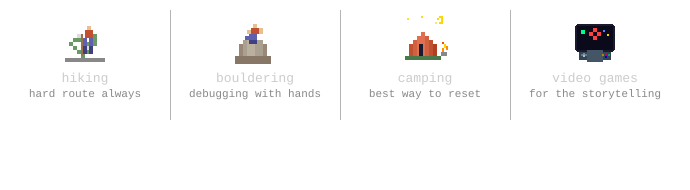

<!-- pixel banner -->

# hey, i'm lydia 👾
**cs sophomore · web dev enthusiast · outdoor nerd**

---

## Stack

`learning:` 

---

## Projects

| project | description | stack |
|--------|-------------|-------|
| **[Remanage](https://github.com/lydiagroza/Remanage)** | Full-stack property management web app with a separate frontend and backend. | TypeScript, Angular |
| **[Meniu_Restaurant](https://github.com/lydiagroza/Meniu_Restaurant)** | Restaurant menu system with functional requirements mapping and JSON-based config. | Java |
| **[Automat-Finit-Determinist](https://github.com/lydiagroza/Automat-Finit-Determinist)** | Builds a deterministic finite automaton from a regular expression. | C++ |

---

## Off the keyboard!

  

## Connect

---

  — always open to building something cool together —

